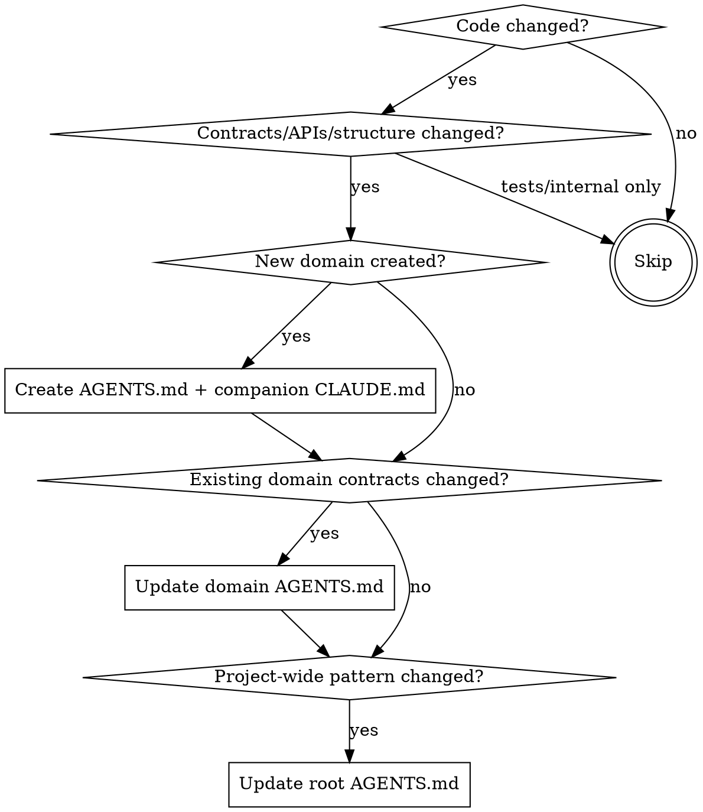

# Maintaining Project Context

**REQUIRED SUB-SKILL:** Use `meta:writing-agents-md-files` for all context file creation and updates.

## Core Principle

Context files (`AGENTS.md`) document contracts and architectural intent. When code changes contracts, the documentation must update. Stale documentation is worse than no documentation.

**Trigger:** End of development phase, branch completion, or any work that changed contracts, APIs, or domain structure.

## Cross-platform Support

Alongside each `AGENTS.md`, write a companion `CLAUDE.md` containing exactly one line:

```markdown
@AGENTS.md
```

## When to Update Context Files

| Change Type | Update Required? | What to Update |
|-------------|------------------|----------------|
| New domain/module | Yes | Create domain context file |
| API/interface change | Yes | Contracts section |
| Architectural decision | Yes | Key Decisions section |
| Invariant change | Yes | Invariants section |
| Dependency change | Yes | Dependencies section |
| Bug fix (no contract change) | No | - |
| Refactor (same behavior) | No | - |
| Test additions | No | - |

## The Process

### Step 1: Identify What Changed

Diff against the base (branch start or phase start):

```bash
# Get changed files
git diff --name-only <base-sha> HEAD

# Get detailed changes
git diff <base-sha> HEAD --stat
```

Categorize changes:
- **Structural:** New directories, moved files
- **Contract:** Changed exports, interfaces, public APIs
- **Behavioral:** Changed invariants, guarantees
- **Internal:** Implementation details only

### Step 2: Map Changes to Context Files

For each significant change, determine which context file should document it:

| Change Location | Context File Location |
|-----------------|----------------------|
| Project-wide pattern | Root context file |
| New domain | `<domain>/` context file (create) |
| Existing domain contract | `<domain>/` context file (update) |
| Cross-domain dependency | Both affected domains |

**Hierarchy rule:** Information belongs at the lowest level where it applies. Domain-specific contracts go in domain files, not root.

When creating new domain context files, create both `AGENTS.md` (with content) and `CLAUDE.md` (companion pointer).

### Step 3: Verify Contracts Still Hold

For each affected context file, verify:

1. **Contracts section:** Do exposes/guarantees/expects match current code?
2. **Dependencies section:** Are uses/used-by/boundary accurate?
3. **Invariants section:** Are all invariants still enforced?
4. **Key Decisions section:** Any new decisions to document?

```bash
# Find domain's public exports
grep -r "export" <domain>/index.ts

# Find domain's imports (dependencies)
grep -r "from '\.\." <domain>/
```

### Step 4: Update or Create Context Files

**For updates:**
1. Read the existing `AGENTS.md` first
2. Update freshness date via `date +%Y-%m-%d`
3. Update affected sections
4. Remove stale content
5. Verify under token budget (<100 lines for domain files)

**For new domains:**
1. Create `<domain>/AGENTS.md` using the template from `meta:writing-agents-md-files`
2. Document purpose, contracts, dependencies, invariants
3. Set freshness date
4. Create the companion `<domain>/CLAUDE.md`:
   ```markdown
   @AGENTS.md
   ```

### Step 5: Commit Documentation Updates

```bash
git add <affected AGENTS.md files and their companion CLAUDE.md files>
git commit -m "docs: update project context for <branch-name>"
```

## Decision Tree



## Quick Reference

**Always update when:**
- New public exports added
- Interface signatures changed
- Invariants added/removed
- Dependencies changed
- Architectural decisions made

**Never update for:**
- Internal refactoring
- Bug fixes that don't change contracts
- Test file changes
- Comment/documentation-only changes

## Common Mistakes

| Mistake | Fix |
|---------|-----|
| Updating for every change | Only update for contract changes |
| Forgetting freshness date | Always use `date +%Y-%m-%d` |
| Documenting implementation | Document contracts and intent |
| Putting domain info in root | Use domain context files for domain contracts |
| Skipping verification | Read the code, confirm contracts hold |
| Putting content in the companion `CLAUDE.md` | Content goes in `AGENTS.md`; the companion is one line |
| Writing `AGENTS.md` without reading | Always read existing content before updating |
| Forgetting the companion `CLAUDE.md` | Every `AGENTS.md` needs one beside it |

## Integration Points

**Called by:**
- **`meta:project-context-librarian` agent** - Uses this skill to coordinate updates
- **`core:execute-implement-a-project`** (Step 5b) - After all tasks complete
- **`core:execute-finishing-a-development-branch`** (Step 4b) - Before merge/PR

**Uses:**
- **`meta:writing-agents-md-files`** - For actual context file creation/updates
